# 📋 Gunkong Backend - Technical Specification

> **Version:** 1.0.0  
> **Project:** Escrow Transaction Platform Backend API  
> **Technology:** Node.js, Express, PostgreSQL, Sequelize  
> **Last Updated:** October 14, 2025

---

## 📚 Table of Contents

1. [System Architecture](#-system-architecture)
2. [API Specification](#-api-specification)
3. [Database Design](#-database-design)
4. [Security Specification](#-security-specification)
5. [Performance Requirements](#-performance-requirements)
6. [Error Handling](#-error-handling)
7. [Data Models](#-data-models)
8. [Integration Specifications](#-integration-specifications)

---

## 🏗 System Architecture

### **High-Level Architecture**

```
┌─────────────────┐    ┌─────────────────┐    ┌─────────────────┐
│   Frontend      │    │   Mobile App    │    │   Admin Panel   │
│   (React/Vue)   │    │   (React Native)│    │   (React)       │
└─────────┬───────┘    └─────────┬───────┘    └─────────┬───────┘
          │                      │                      │
          └──────────────────────┼──────────────────────┘
                                 │
                       ┌─────────▼───────┐
                       │   API Gateway   │
                       │   (Express.js)  │
                       └─────────┬───────┘
                                 │
          ┌──────────────────────┼──────────────────────┐
          │                      │                      │
┌─────────▼───────┐    ┌─────────▼───────┐    ┌─────────▼───────┐
│ Authentication  │    │  Transaction    │    │   Data Access   │
│   & Escrow      │    │    Rooms        │    │     Layer       │
│   Services      │    │  (Controllers)  │    │   (Models/ORM)  │
└─────────────────┘    └─────────────────┘    └─────────┬───────┘
                                                        │
                                              ┌─────────▼───────┐
                                              │   PostgreSQL    │
                                              │    Database     │
                                              └─────────────────┘
```

### **Core Business Model**

Gunkong is an **escrow transaction platform** that enables secure peer-to-peer transactions through:

1. **Transaction Rooms** - Temporary spaces where buyers and sellers negotiate and complete transactions
2. **Escrow Payments** - Platform holds buyer's payment until transaction is completed
3. **Secure Process** - Verified shipping, tracking, and dispute resolution
4. **Platform Fees** - Revenue through transaction fees on successful completions
   └─────────────────┘

```

### **Layer Architecture**

#### **1. Presentation Layer**

-   **Routes** - Transaction room endpoints, payment APIs, user management
-   **Middleware** - Authentication, validation, rate limiting, error handling
-   **Response Formatting** - Consistent API responses following specification

#### **2. Business Logic Layer**

-   **Transaction Controllers** - Room creation, status management, completion flow
-   **Payment Controllers** - Escrow management, payment processing, refunds
-   **User Controllers** - Authentication, profile management, bank account setup
-   **Admin Controllers** - Platform management, dispute resolution, analytics

#### **3. Data Access Layer**

-   **Models** - Sequelize ORM models for all entities
-   **Database** - PostgreSQL with connection pooling
-   **Migrations** - Schema versioning and status lookup tables

#### **4. Infrastructure Layer**

-   **Configuration** - Environment-based settings
-   **Logging** - Structured logging for transaction audit trails
-   **Security** - JWT authentication, input validation, PCI compliance
-   **Payment Integration** - PromptPay, bank transfer gateways

---

## 🔌 API Specification

### **Base URL Structure**

```

Development: http://localhost:8000/api
Staging: https://api-staging.gunkong.com/api
Production: https://api.gunkong.com/api

```

### **API Versioning Strategy**

```

Current: /api/v1 (implied default)
Future: /api/v2 (breaking changes)

````

### **HTTP Methods & Usage**

| Method   | Usage                   | Example                 |
| -------- | ----------------------- | ----------------------- |
| `GET`    | Retrieve data           | `GET /api/users`        |
| `POST`   | Create resource         | `POST /api/users`       |
| `PUT`    | Update/Replace resource | `PUT /api/users/123`    |
| `PATCH`  | Partial update          | `PATCH /api/users/123`  |
| `DELETE` | Remove resource         | `DELETE /api/users/123` |

### **Request/Response Format**

#### **Request Headers**

```http
Content-Type: application/json
Authorization: Bearer <JWT_TOKEN>
Accept: application/json
User-Agent: GunkongApp/1.0.0
````

#### **Response Format**

```json
{
    "apiVersion": "0.1.0",
    "data": {
        "title": "string",
        "description": "string",

        // For single object
        "item": {
            // data object
            "success": true,
            "pagination": {
                "page": 1,
                "limit": 20,
                "total": 100,
                "pages": 5,
                "hasNext": true,
                "hasPrev": false
            },
            "errors": []
        },
        // For array of objects
        "items": [
            {
                // data1
            },
            {
                // data2
            }
        ]
    }
}
```

#### **Error Response Format**

```json
{
    "apiVersion": "0.1.0",
    "data": {
        "title": "Validation Error",
        "description": "Request validation failed",
        "data": {
            "success": false,
            "errors": [
                {
                    "field": "email",
                    "message": "Email is required",
                    "code": "VALIDATION_ERROR",
                    "value": null
                }
            ]
        }
    }
}
```

````

### **Status Code Standards**

| Code | Meaning               | Usage                      |
| ---- | --------------------- | -------------------------- |
| 200  | OK                    | Successful GET, PUT, PATCH |
| 201  | Created               | Successful POST            |
| 204  | No Content            | Successful DELETE          |
| 400  | Bad Request           | Validation errors          |
| 401  | Unauthorized          | Authentication required    |
| 403  | Forbidden             | Insufficient permissions   |
| 404  | Not Found             | Resource not found         |
| 409  | Conflict              | Resource already exists    |
| 422  | Unprocessable Entity  | Business logic error       |
| 429  | Too Many Requests     | Rate limiting              |
| 500  | Internal Server Error | Server error               |

---

## 🔐 Authentication & Authorization

### **JWT Token Structure**

```json
{
    "header": {
        "alg": "HS256",
        "typ": "JWT"
    },
    "payload": {
        "userId": "uuid-v4",
        "email": "user@example.com",
        "username": "john_doe",
        "role": "user",
        "iat": 1634567890,
        "exp": 1635172690
    }
}
````

### **Authentication Flow**


### **Authorization Levels**

1. **Public** - No authentication required
2. **Authenticated** - Valid JWT token required
3. **Owner** - Resource ownership verification
4. **Admin** - Administrative privileges required

---

## 📊 Database Design

### **Database Schema Overview**

#### **Core Tables (Current Implementation)**

```sql
-- Status Lookup Tables
transaction_statuses (
    code VARCHAR PK, -- CREATED, PENDING_PAYMENT, PAID, SHIPPED, COMPLETED, CANCELLED
    name VARCHAR
)

payment_statuses (
    code VARCHAR PK, -- PENDING, HELD, RELEASED, REFUNDED
    name VARCHAR
)

-- User Management
users (
    id UUID PK,
    email VARCHAR UNIQUE,
    username VARCHAR UNIQUE,
    phone VARCHAR,
    full_name VARCHAR,
    password VARCHAR,
    role VARCHAR DEFAULT 'USER', -- USER, ADMIN
    bank_account_number VARCHAR, -- สำหรับ seller
    bank_code VARCHAR, -- สำหรับ seller
    is_active BOOLEAN,
    created_at TIMESTAMP,
    updated_at TIMESTAMP
)

-- Transaction Rooms (Core Feature)
transaction_rooms (
    id UUID PK,
    room_code VARCHAR UNIQUE, -- สำหรับ share link
    creator_id UUID FK, -- คนสร้าง room (อาจเป็น buyer/seller)
    buyer_id UUID FK, -- references users.id
    seller_id UUID FK, -- references users.id
    status VARCHAR FK, -- references transaction_statuses.code
    item_title VARCHAR, -- ชื่อสินค้า/บริการ
    item_description TEXT,
    quantity INTEGER,
    item_price_cents INTEGER,
    shipping_fee_cents INTEGER,
    platform_fee_cents INTEGER,
    total_cents INTEGER,
    currency VARCHAR DEFAULT 'THB',
    item_images JSON, -- array of URLs
    shipping_address_id UUID FK,
    tracking_number VARCHAR,
    paid_at TIMESTAMP, -- buyer จ่ายเงิน
    payment_verified_at TIMESTAMP, -- admin verify payment
    payment_verified_by UUID FK, -- references users.id (admin)
    shipped_at TIMESTAMP, -- seller ส่งของ
    completed_at TIMESTAMP, -- transaction สำเร็จ
    cancelled_at TIMESTAMP,
    cancelled_by UUID FK, -- references users.id (admin/user)
    cancellation_reason TEXT,
    expires_at TIMESTAMP, -- room หมดอายุถ้าไม่มีการดำเนินการ
    closed_at TIMESTAMP, -- ปิด room แล้ว
    created_at TIMESTAMP,
    updated_at TIMESTAMP
)

-- Shipping Addresses (เฉพาะ transaction นั้นๆ)
shipping_addresses (
    id UUID PK,
    room_id UUID FK, -- references transaction_rooms.id
    recipient_name VARCHAR,
    phone VARCHAR,
    address_line1 VARCHAR,
    district VARCHAR,
    province VARCHAR,
    postal_code VARCHAR,
    created_at TIMESTAMP
)

-- Payments (Escrow)
payments (
    id UUID PK,
    room_id UUID FK, -- references transaction_rooms.id
    provider VARCHAR, -- PROMPTPAY, BANK_TRANSFER
    amount_cents INTEGER,
    currency VARCHAR DEFAULT 'THB',
    status VARCHAR FK, -- references payment_statuses.code
    transaction_ref VARCHAR, -- จาก payment gateway
    held_at TIMESTAMP, -- เงินถูก hold
    released_at TIMESTAMP, -- โอนให้ seller
    refunded_at TIMESTAMP, -- คืนเงินให้ buyer
    slip_image JSON, -- หลักฐานการโอน
    created_at TIMESTAMP,
    updated_at TIMESTAMP
)

-- Archived Transactions (เก็บประวัติ)
archived_transactions (
    id UUID PK,
    room_id UUID FK, -- references transaction_rooms.id
    room_code VARCHAR,
    buyer_id UUID FK, -- references users.id
    seller_id UUID FK, -- references users.id
    item_title VARCHAR,
    total_cents INTEGER,
    currency VARCHAR,
    platform_fee_earned_cents INTEGER,
    completed_at TIMESTAMP,
    room_snapshot JSON, -- backup ข้อมูล room ทั้งหมด
    archived_at TIMESTAMP
)
```

### **Indexing Strategy**

```sql
-- Primary Keys (UUID)
CREATE INDEX idx_users_id ON users(id);
CREATE INDEX idx_transaction_rooms_id ON transaction_rooms(id);
CREATE INDEX idx_payments_id ON payments(id);
CREATE INDEX idx_shipping_addresses_id ON shipping_addresses(id);

-- Unique Constraints
CREATE UNIQUE INDEX idx_users_email ON users(email);
CREATE UNIQUE INDEX idx_users_username ON users(username);
CREATE UNIQUE INDEX idx_transaction_rooms_room_code ON transaction_rooms(room_code);

-- Foreign Keys Performance
CREATE INDEX idx_transaction_rooms_creator_id ON transaction_rooms(creator_id);
CREATE INDEX idx_transaction_rooms_buyer_id ON transaction_rooms(buyer_id);
CREATE INDEX idx_transaction_rooms_seller_id ON transaction_rooms(seller_id);
CREATE INDEX idx_payments_room_id ON payments(room_id);
CREATE INDEX idx_shipping_addresses_room_id ON shipping_addresses(room_id);
CREATE INDEX idx_archived_transactions_room_id ON archived_transactions(room_id);

-- Search Optimization
CREATE INDEX idx_users_phone ON users(phone);
CREATE INDEX idx_users_role ON users(role);
CREATE INDEX idx_users_username ON users(username);
CREATE INDEX idx_transaction_rooms_status ON transaction_rooms(status);
CREATE INDEX idx_payments_status ON payments(status);
CREATE INDEX idx_transaction_rooms_item_title ON transaction_rooms(item_title);

-- Performance Optimization
CREATE INDEX idx_transaction_rooms_status_created ON transaction_rooms(status, created_at);
CREATE INDEX idx_payments_status_created ON payments(status, created_at);
CREATE INDEX idx_transaction_rooms_expires_at ON transaction_rooms(expires_at);
CREATE INDEX idx_archived_transactions_completed_at ON archived_transactions(completed_at);

-- Admin Functions Optimization
CREATE INDEX idx_transaction_rooms_payment_verified_by ON transaction_rooms(payment_verified_by);
CREATE INDEX idx_transaction_rooms_cancelled_by ON transaction_rooms(cancelled_by);
CREATE INDEX idx_transaction_rooms_payment_verified_at ON transaction_rooms(payment_verified_at);

-- Business Logic Optimization
CREATE INDEX idx_transaction_rooms_buyer_status ON transaction_rooms(buyer_id, status);
CREATE INDEX idx_transaction_rooms_seller_status ON transaction_rooms(seller_id, status);
CREATE INDEX idx_payments_provider_status ON payments(provider, status);
```

### **Data Relationships**

```mermaid
erDiagram
    %% Status Lookup Tables
    transaction_statuses {
        varchar code PK "CREATED, PENDING_PAYMENT, PAID, SHIPPED, COMPLETED, CANCELLED"
        varchar name
    }

    payment_statuses {
        varchar code PK "PENDING, HELD, RELEASED, REFUNDED"
        varchar name
    }

    %% User Management
    users {
        uuid id PK
        varchar email UK
        varchar username UK
        varchar phone
        varchar full_name
        varchar password
        varchar role "USER, ADMIN"
        varchar bank_account_number "สำหรับ seller"
        varchar bank_code "สำหรับ seller"
        boolean is_active
        timestamp created_at
        timestamp updated_at
    }

    %% Transaction Rooms (Core Feature)
    transaction_rooms {
        uuid id PK
        varchar room_code UK "สำหรับ share link"
        uuid creator_id FK "คนสร้าง room (อาจเป็น buyer/seller)"
        uuid buyer_id FK "references users.id"
        uuid seller_id FK "references users.id"
        varchar status FK
        varchar item_title "ชื่อสินค้า/บริการ"
        text item_description
        int quantity
        int item_price_cents
        int shipping_fee_cents
        int platform_fee_cents
        int total_cents
        varchar currency "THB"
        json item_images "array of URLs"
        uuid shipping_address_id FK
        varchar tracking_number
        timestamp paid_at "buyer จ่ายเงิน"
        timestamp payment_verified_at "admin verify payment"
        uuid payment_verified_by FK "references users.id (admin)"
        timestamp shipped_at "seller ส่งของ"
        timestamp completed_at "transaction สำเร็จ"
        timestamp cancelled_at
        uuid cancelled_by FK "references users.id (admin/user)"
        text cancellation_reason
        timestamp expires_at "room หมดอายุถ้าไม่มีการดำเนินการ"
        timestamp closed_at "ปิด room แล้ว"
        timestamp created_at
        timestamp updated_at
    }

    %% Shipping Addresses (เฉพาะ transaction นั้นๆ)
    shipping_addresses {
        uuid id PK
        uuid room_id FK
        varchar recipient_name
        varchar phone
        varchar address_line1
        varchar district
        varchar province
        varchar postal_code
        timestamp created_at
    }

    %% Payments (Escrow)
    payments {
        uuid id PK
        uuid room_id FK
        varchar provider "PROMPTPAY, BANK_TRANSFER"
        int amount_cents
        varchar currency "THB"
        varchar status FK
        varchar transaction_ref "จาก payment gateway"
        timestamp held_at "เงินถูก hold"
        timestamp released_at "โอนให้ seller"
        timestamp refunded_at "คืนเงินให้ buyer"
        json slip_image "หลักฐานการโอน"
        timestamp created_at
        timestamp updated_at
    }

    %% Archived Transactions (เก็บประวัติ)
    archived_transactions {
        uuid id PK
        uuid room_id FK
        varchar room_code
        uuid buyer_id FK
        uuid seller_id FK
        varchar item_title
        int total_cents
        varchar currency
        int platform_fee_earned_cents
        timestamp completed_at
        json room_snapshot "backup ข้อมูล room ทั้งหมด"
        timestamp archived_at
    }

    %% Relationships
    users ||--o{ transaction_rooms : "creates"
    users ||--o{ transaction_rooms : "buys (buyer_id)"
    users ||--o{ transaction_rooms : "sells (seller_id)"
    users ||--o{ archived_transactions : "participated"

    transaction_rooms }o--|| transaction_statuses : "has status"
    transaction_rooms ||--o| shipping_addresses : "ships to"
    transaction_rooms ||--o| payments : "paid by"
    transaction_rooms ||--o| archived_transactions : "archived as"

    payments }o--|| payment_statuses : "has status"
```



---

## ⚡ Performance Requirements

### **Response Time Requirements**

| Endpoint Type       | Target Response Time | Maximum Response Time |
| ------------------- | -------------------- | --------------------- |
| Authentication      | <100ms               | <300ms                |
| User Profile        | <150ms               | <400ms                |
| Transaction Rooms   | <200ms               | <500ms                |
| Payment Processing  | <300ms               | <800ms                |
| Escrow Operations   | <500ms               | <1000ms               |
| Room Status Updates | <100ms               | <300ms                |

### **Throughput Requirements**

| Metric               | Target | Peak  |
| -------------------- | ------ | ----- |
| Concurrent Users     | 1,000  | 5,000 |
| Requests/Second      | 500    | 2,000 |
| Database Connections | 50     | 100   |

### **Scalability Requirements**

-   **Horizontal Scaling:** Support for multiple server instances
-   **Database Scaling:** Read replicas and connection pooling
-   **Caching Strategy:** Redis for session and data caching
-   **CDN Integration:** Static asset delivery optimization

---

## 🛡 Security Specification

### **Data Protection**

```javascript
// Password Hashing
const hashedPassword = await bcrypt.hash(password, 12)

// Input Sanitization
const sanitizedInput = validator.escape(userInput)

// SQL Injection Prevention
const user = await User.findOne({
    where: { email: sequelize.escape(email) },
})
```

### **Security Headers**

```javascript
app.use(
    helmet({
        contentSecurityPolicy: {
            directives: {
                defaultSrc: ["'self'"],
                scriptSrc: ["'self'"],
                styleSrc: ["'self'", "'unsafe-inline'"],
                imgSrc: ["'self'", 'data:', 'https:'],
            },
        },
        hsts: {
            maxAge: 31536000,
            includeSubDomains: true,
            preload: true,
        },
    })
)
```

### **Rate Limiting**

```javascript
const rateLimit = require('express-rate-limit')

const authLimiter = rateLimit({
    windowMs: 15 * 60 * 1000, // 15 minutes
    max: 5, // limit each IP to 5 requests per windowMs
    message: 'Too many login attempts, please try again later',
})
```

---

## 🧪 Testing Specification

### **Test Structure**

```
tests/
├── unit/
│   ├── controllers/
│   ├── models/
│   ├── middleware/
│   └── utils/
├── integration/
│   ├── auth/
│   ├── users/
│   └── admin/
├── e2e/
│   ├── user-flows/
│   └── admin-flows/
└── load/
    └── scenarios/
```

### **Test Coverage Requirements**

-   **Unit Tests:** >80% code coverage
-   **Integration Tests:** All API endpoints
-   **E2E Tests:** Critical user flows
-   **Load Tests:** Performance benchmarks

### **Test Data Management**

```javascript
// Test Database Setup
beforeEach(async () => {
    await sequelize.sync({ force: true })
    await seedTestData()
})

afterEach(async () => {
    await cleanupTestData()
})
```

---

## 📈 Monitoring & Logging

### **Application Metrics**

```javascript
// Custom Metrics
const responseTime = Date.now() - req.startTime
metrics.timing('api.response_time', responseTime, [
    `endpoint:${req.route.path}`,
])

// Error Tracking
logger.error('Database connection failed', {
    error: error.message,
    stack: error.stack,
    userId: req.user?.id,
    requestId: req.id,
})
```

### **Health Check Specification**

```json
{
    "status": "healthy",
    "timestamp": "2025-10-11T10:30:00.000Z",
    "version": "1.0.0",
    "services": {
        "database": {
            "status": "healthy",
            "responseTime": "5ms",
            "connections": {
                "active": 5,
                "idle": 2,
                "total": 7
            }
        },
        "redis": {
            "status": "healthy",
            "responseTime": "2ms"
        }
    },
    "system": {
        "uptime": "1d 2h 30m",
        "memory": {
            "used": "245MB",
            "total": "512MB",
            "percentage": 47.8
        },
        "cpu": {
            "usage": "15.2%"
        }
    }
}
```

---

## 🔄 Error Handling

### **Error Classification**

```javascript
class AppError extends Error {
    constructor(message, statusCode, code = null, isOperational = true) {
        super(message)
        this.statusCode = statusCode
        this.code = code
        this.isOperational = isOperational
        this.timestamp = new Date().toISOString()

        Error.captureStackTrace(this, this.constructor)
    }
}

// Usage Examples
throw new AppError('User not found', 404, 'USER_NOT_FOUND')
throw new AppError('Invalid email format', 400, 'VALIDATION_ERROR')
throw new AppError('Insufficient permissions', 403, 'FORBIDDEN')
```

### **Global Error Handler**

```javascript
const globalErrorHandler = (err, req, res, next) => {
    const error = {
        success: false,
        message: err.message,
        code: err.code,
        timestamp: err.timestamp || new Date().toISOString(),
        requestId: req.id,
    }

    // Log error
    logger.error('Global error handler', {
        error: err.message,
        stack: err.stack,
        statusCode: err.statusCode,
        userId: req.user?.id,
        requestId: req.id,
    })

    // Send response
    res.status(err.statusCode || 500).json(error)
}
```

---

## 📋 Data Validation

### **Input Validation Rules**

```javascript
const validationRules = {
    // User Management
    email: {
        required: true,
        format: 'email',
        maxLength: 255,
        sanitize: 'normalizeEmail',
    },
    password: {
        required: true,
        minLength: 6,
        maxLength: 128,
        pattern: /^(?=.*[a-z])(?=.*[A-Z])(?=.*\d)/,
    },
    phone: {
        required: false,
        pattern: /^\+?[1-9]\d{1,14}$/,
        sanitize: 'escape',
    },
    username: {
        required: true,
        minLength: 3,
        maxLength: 100,
        pattern: /^[a-zA-Z0-9_]+$/,
        sanitize: 'escape',
    },
    fullName: {
        required: true,
        minLength: 1,
        maxLength: 200,
        sanitize: 'escape',
    },
    role: {
        required: false,
        enum: ['USER', 'ADMIN'],
        default: 'USER',
    },

    // Transaction Room Validation
    itemTitle: {
        required: true,
        minLength: 3,
        maxLength: 200,
        sanitize: 'escape',
    },
    itemDescription: {
        required: false,
        maxLength: 2000,
        sanitize: 'escape',
    },
    quantity: {
        required: true,
        type: 'integer',
        min: 1,
        max: 10000,
    },
    itemPriceCents: {
        required: true,
        type: 'integer',
        min: 1,
        max: 100000000, // 1M THB max
    },
    currency: {
        required: true,
        enum: ['THB'],
    },

    // Admin/Cancellation Validation
    cancellationReason: {
        required: false,
        maxLength: 1000,
        sanitize: 'escape',
    },

    // Payment Validation
    paymentProvider: {
        required: true,
        enum: ['PROMPTPAY', 'BANK_TRANSFER'],
    },
    bankAccountNumber: {
        required: false,
        pattern: /^\d{10,12}$/,
        sanitize: 'escape',
    },
    bankCode: {
        required: false,
        pattern: /^\d{3}$/,
        sanitize: 'escape',
    },

    // Address Validation
    recipientName: {
        required: true,
        minLength: 1,
        maxLength: 100,
        sanitize: 'escape',
    },
    addressLine1: {
        required: true,
        minLength: 5,
        maxLength: 200,
        sanitize: 'escape',
    },
    district: {
        required: true,
        minLength: 1,
        maxLength: 100,
        sanitize: 'escape',
    },
    province: {
        required: true,
        minLength: 1,
        maxLength: 100,
        sanitize: 'escape',
    },
    postalCode: {
        required: true,
        pattern: /^\d{5}$/,
        sanitize: 'escape',
    },
}
```

### **Database Constraints**

```sql
-- User Validation
ALTER TABLE users ADD CONSTRAINT email_format
CHECK (email ~ '^[A-Za-z0-9._%+-]+@[A-Za-z0-9.-]+\.[A-Za-z]{2,}$');

ALTER TABLE users ADD CONSTRAINT phone_format
CHECK (phone IS NULL OR phone ~ '^\+?[1-9]\d{1,14}$');

ALTER TABLE users ADD CONSTRAINT bank_account_format
CHECK (bank_account_number IS NULL OR bank_account_number ~ '^\d{10,12}$');

ALTER TABLE users ADD CONSTRAINT bank_code_format
CHECK (bank_code IS NULL OR bank_code ~ '^\d{3}$');

ALTER TABLE users ADD CONSTRAINT role_valid
CHECK (role IN ('USER', 'ADMIN'));

-- Transaction Room Validation
ALTER TABLE transaction_rooms ADD CONSTRAINT item_price_positive
CHECK (item_price_cents > 0);

ALTER TABLE transaction_rooms ADD CONSTRAINT shipping_fee_non_negative
CHECK (shipping_fee_cents >= 0);

ALTER TABLE transaction_rooms ADD CONSTRAINT platform_fee_non_negative
CHECK (platform_fee_cents >= 0);

ALTER TABLE transaction_rooms ADD CONSTRAINT quantity_positive
CHECK (quantity > 0);

ALTER TABLE transaction_rooms ADD CONSTRAINT currency_valid
CHECK (currency IN ('THB'));

ALTER TABLE transaction_rooms ADD CONSTRAINT expires_after_creation
CHECK (expires_at > created_at);

-- Payment Validation
ALTER TABLE payments ADD CONSTRAINT amount_positive
CHECK (amount_cents > 0);

ALTER TABLE payments ADD CONSTRAINT currency_valid
CHECK (currency IN ('THB'));

ALTER TABLE payments ADD CONSTRAINT provider_valid
CHECK (provider IN ('PROMPTPAY', 'BANK_TRANSFER'));

-- Address Validation
ALTER TABLE shipping_addresses ADD CONSTRAINT postal_code_format
CHECK (postal_code ~ '^\d{5}$');

-- Status Validation
ALTER TABLE transaction_rooms ADD CONSTRAINT status_valid
CHECK (status IN ('CREATED', 'PENDING_PAYMENT', 'PAID', 'SHIPPED', 'COMPLETED', 'CANCELLED'));

ALTER TABLE payments ADD CONSTRAINT payment_status_valid
CHECK (status IN ('PENDING', 'HELD', 'RELEASED', 'REFUNDED'));
```

---

## 🚀 Deployment Specification

### **Environment Configuration**

```yaml
# Development
NODE_ENV: development
PORT: 8000
DB_HOST: localhost
DB_PORT: 5432
LOG_LEVEL: debug

# Staging
NODE_ENV: staging
PORT: 8000
DB_HOST: staging-db.amazonaws.com
DB_PORT: 5432
LOG_LEVEL: info

# Production
NODE_ENV: production
PORT: 8000
DB_HOST: prod-db.amazonaws.com
DB_PORT: 5432
LOG_LEVEL: warn
```

### **Docker Configuration**

```dockerfile
FROM node:18-alpine

WORKDIR /app

COPY package*.json ./
RUN npm ci --only=production

COPY . .

USER node

EXPOSE 8000

CMD ["node", "index.js"]
```

### **Health Check Configuration**

```yaml
healthcheck:
    test: ['CMD', 'curl', '-f', 'http://localhost:8000/api/health']
    interval: 30s
    timeout: 10s
    retries: 3
    start_period: 40s
```

---

**Document Version:** 1.0.0  
**Last Updated:** October 14, 2025  
**Next Review:** November 14, 2025  
**Maintained by:** Gunkong Development Team
